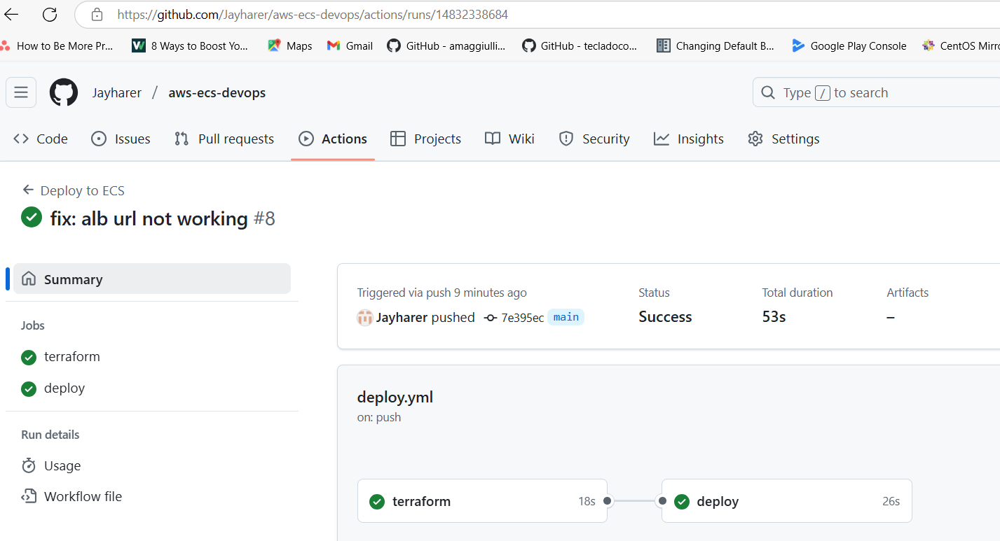
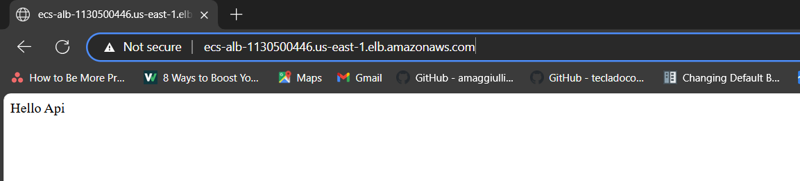
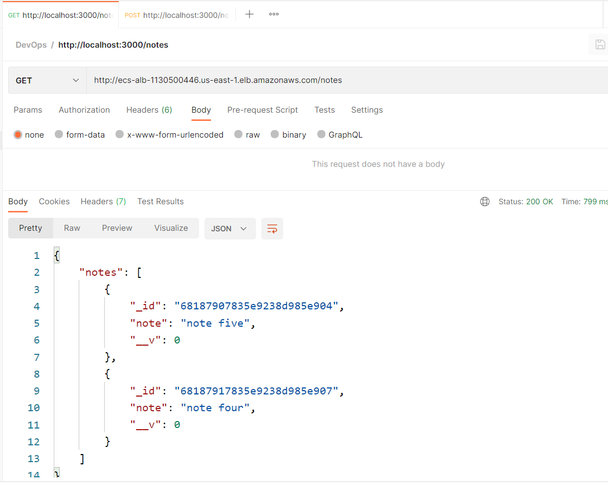

# ECS-DevOps
Deploying note app on ECS with myapp and mongo db docker contanaier.
Using Github action for CICD and terraform for Infrastructure deployment.

## Tools Used
1. AWS Cloud
2. Github Actions
3. Terraform
4. Git
6. aws-cli
---

## Deployment stepes

### 1. Update **terraform/backend.tf** with
```
bucket = "custom-s3-bucket-name"
```

### 2. Clone repo
```bash
git clone https://github.com/Jayharer/aws-ecs-devops.git
```

### 3. Create new repo in Github and Configure Following secrets in GithubActions as new repository secrets 
```
AWS_ACCESS_KEY_ID
AWS_SECRET_ACCESS_KEY
AWS_REGION
```

### 5. Push changes to new Github repo
```bash
cd aws-ecs-devops
git remote remove origin
git remote add origin "<https-url-of-your-new-git-remote-repo>"
git branch -M main
git push -uf origin main
```

### 6. Afetr successful deployment check Github Action Result


### 7. Afetr successful deployment check AWS alb url in browser


### 7. Afetr successful deployment check API working


### 8. Clean up, terraform destroy
```bash
cd terraform
terraform destroy
```


